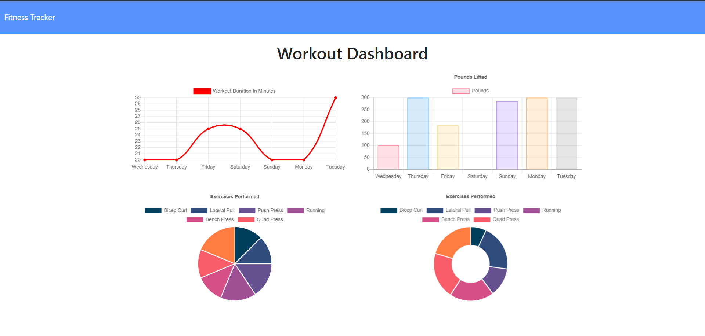

# workout_tracker

## Desription
    The purpose of this assignment was to complete the backend code to work with the provided front end code. 

    Mongo DB was created to allow my read writes to get data from the DB. Get routes would retrieve the data, put and post routes would add to and edit the data within the DB.

    Application will be deployed on Heroku using Mongo Atlas.

## Table of Contents
 - [Installation](#installation)
 - [Usage](#usage)
 - [License](#license)
 - [Contributing](#contributing)
 - [Tests](#tests)
 - [Questions](#questions)

## Installation
    espress, mongoose    
## Usage
    
## License
    MIT License
## Contributing
    Nick Leoni
## Tests
    
## Questions
[GitHub Repo Link](https://github.com/njleoni/workout_tracker) 
\n[Heroku Link](https://powerful-spire-65295.herokuapp.com/)
#### If you have any additional questions, please contact me at nicholas.leoni@gmail.com

## Screenshot

